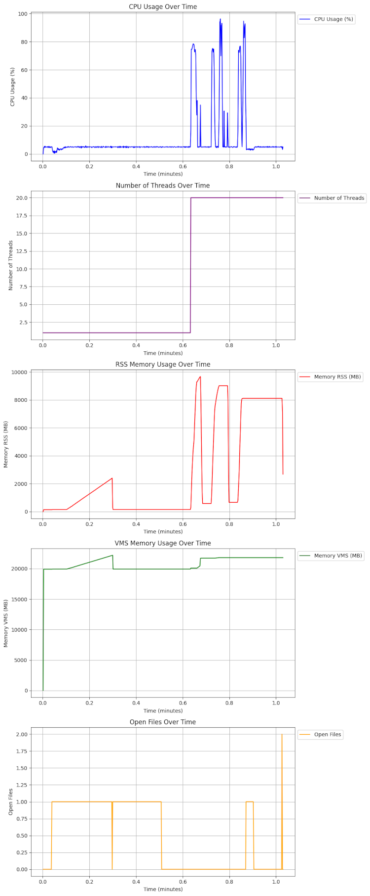

# EZTimem
A simple yet powerful script for **Easy** **Ti**me and **Me**mory **M**anagement.

For any executable, you can easily measure:
- Average runtime
- CPU usage
- Memory usage
- Amount of data read/written to disk
- Number of threads used over time
- And more...

## Installing dependencies
First, you must have a Python 3 environment (any version) and install the packages in `requirements.txt`.

## How to run
You can request EZTimem to monitor the resources used by your application by running it as follows:

```
python eztimem.py <command>
```

Since it consists of a single script, you can copy it to your `/usr/local/bin` if you want.

## Output example

The expected output is something like the example below:

```
==========================================================
=                     EZTIMEM REPORT                     =
==========================================================
 Command: ./my-application
 Start Time: 2024-07-25 23:57:58.294787
 Finish Time: 2024-07-25 23:59:00.231610
 Total Time: 61.94 seconds
 Total Disk Read: 0.12 MB
 Total Disk Write: 200.71 MB
 Total Voluntary Ctxt Switch: 113629
 Total Involuntary Ctxt Switch: 534
+------------------+----------+-----------+----------+
| Process Report   | Average  | Std. Dev. | Max.     |
+------------------+----------+-----------+----------+
| CPU Usage        | 9.28 %   | 16.76 %   | 96.27 %  |
| Memory (%)       | 16.65 %  | 21.75 %   | 61.60 %  |
| Memory (RSS)     | 2.55 GB  | 3.33 GB   | 9.44 GB  |
| Memory (VMS)     | 20.24 GB | 1.43 GB   | 21.66 GB |
| Threads Used     | 7.98     | 9.16      | 20.00    |
| Open Files       | 0.51     | 0.50      | 2.00     |
| Process Priority | 0.00     | 0.00      | 0.00     |
+------------------+----------+-----------+----------+
+----------------+----------+-----------+----------+
| GPU Report     | Average  | Std. Dev. | Max.     |
+----------------+----------+-----------+----------+
| GPU Usage      | 0.17 %   | 0.15 %    | 0.43 %   |
| GPU Memory     | 73.00 MB | 0.00 MB   | 73.00 MB |
| GPU Memory (%) | 1.19 %   | 0.00 %    | 1.19 %   |
+----------------+----------+-----------+----------+
----------------------------------------
 Plots saved in eztimem_plots.png
----------------------------------------
 For your information:
* EZTIMEM monitoring checks are made every 0.05 seconds.
* CPU usage considers all cores.
* VMS Memory = total amount of virtual memory used by a process,
  including all code, data, and shared libraries plus pages that have
  been swapped out.
* RSS Memory = portion of memory occupied by a process that is held
  in RAM, excluding swapped-out pages.
* Process Priority = default is zero.
* All reports consider only the resources utilized by the process,
  except for the GPU, which is reported for the entire system usage.
```

EZTimem also exports plots by default:



## Future Features

Possible future features:
- Include more plots
- Include support for plots in the command line (ASCII, text only)
- Include support to monitor child processes
- More detailed descriptions
- And more...

## Common Questions

- Why is my CPU usage above 100%?

  A: This is possible. To fix this, try reducing the monitoring interval.

- How can I reduce the monitoring interval?

  A: You can do so by changing the `monitor_interval` parameter in the code.
     The default is 0.1 seconds.

## Issues

If you have any questions or encounter any bugs, please feel free to use the issue tracker.

## Acknowledgment

The DALL-E 2 was used to create the EZTimem logo.
